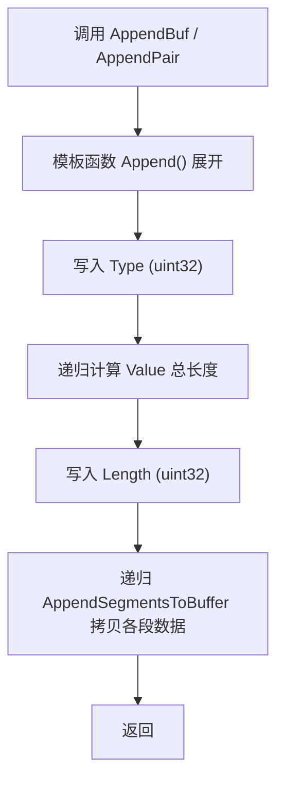
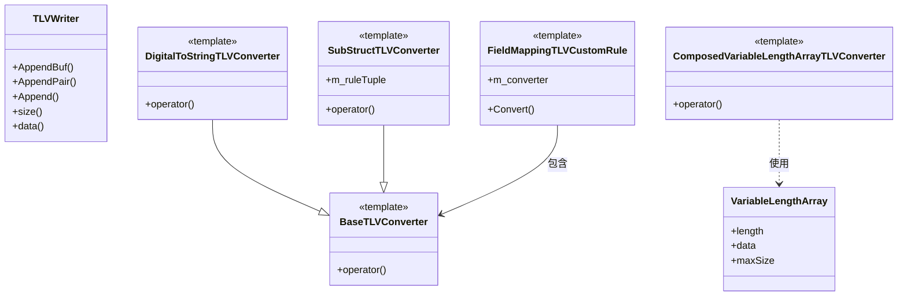

# TLVWriter 软件实现设计文档

## 1. 背景与目标
TLV（Type-Length-Value）是一种广泛应用于通信协议和持久化存储的数据编码格式。`include/tlv/tlv_writer.h` 文件提供了一个轻量、可扩展且高性能的 **TLV 写入器**实现，结合项目中现有的字段映射（`FieldMapping`）与聚合体反射能力，实现了 **业务结构体 → TLV 二进制流** 的自动化、声明式序列化。本文档旨在从设计视角阐述 `TLVWriter` 及其配套转换器、宏的实现要点与扩展思路，帮助后续维护者快速理解并二次开发。

### 1.1 设计思路与原则
* **声明式映射、编译期校验**：通过 `FieldMapping` 与反射宏，开发者仅需声明字段到 TLV 规则，所有序列化逻辑在编译期展开，避免运行时字符串反射带来的开销与风险。
* **模板组合优先**：核心功能以 **Converter 模板** + **规则宏** 组合完成，保持"积木式"扩展：无需修改底层库即可支持新业务类型或编码策略。
* **最小运行时依赖**：`TLVWriter` 本身只依赖 STL 容器，不依赖第三方库；同一文件内实现全部辅助模板，保证易于移植。
* **零虚函数、零 RTTI**：全部通过模板静态分派，消除虚表开销，符合 **zero-overhead** 设计准则。
* **单向耦合**：Converter 仅依赖 `TLVWriter` 输出接口，Writer 对 Converter 无感知，便于替换输出目标（如直接写 socket、文件）。
* **渐进式优化**：先满足业务正确性，再通过调整 `reserve`、内联等措施按需提升性能。

## 2. TLVWriter 类设计
### 2.1 成员与基本职责
```c++
class TLVWriter {
    std::vector<uint8_t> m_buffer; // 底层缓冲区，保存完整 TLV 数据
};
```
* **m_buffer**：内部独占的可增长缓冲区，避免外部管理复杂性。
* **职责**：负责将 <Type, Length, Value> 三元组以顺序形式写入 `m_buffer`。不负责字节序转换，由上层在跨端场景自行处理。

### 2.2 Append 统一入口
```c++
template <typename... Args>
int32_t Append(uint32_t type, Args&&... args);
```
* **可变模板参数** `Args` 按 *指针 + 长度* 成对出现，允许一次写入多段数据（如带 key 的场景）。
* 静态断言确保参数合法：`sizeof...(Args) % 2 == 0`。
* 写入流程：
  1. 写入 `type` (`uint32_t`)
  2. 递归计算所有段长度 → `valueLen` (`uint32_t`)
  3. 写入 `valueLen`
  4. 递归拷贝各段数据到 `m_buffer`
* 返回值暂固定为 `0`，保留错误码扩展点。

### 2.3 高阶包装接口
* **AppendBuf**：仅写入单段数据。
* **AppendPair**：常用于 *key + value* 场景；内部调用 `Append` 拼接两段数据。

### 2.4 内存与性能
* 通过 `reserve(initialCapacity)` 预留空间，减少多次 `realloc`。
* 所有拷贝均使用 `std::vector::insert`，在 `-O2` 优化下与 `memcpy` 等价。
* 无锁设计，**不允许多线程并发写同一实例**；跨线程请实例化独立对象。

## 3. VariableLengthArray 设计
在 C 语言风格数组（栈上固定容量）+ 长度字段常见的业务模型中，`VariableLengthArray` 充当桥梁：
```c++
struct VariableLengthArray {
    uint32_t length;  // 实际元素个数
    const T* data;    // 指针
    size_t  maxSize;  // 可选：最大容量
};
```
配合助手 `MakeVariableLengthArray` 迅速将「长度字段 + 数组」封装为可序列化对象。

## 4. Converter 体系
### 4.1 BaseTLVConverter
* 模板参数：`tlvType` 与可选 `keyName`。
* 处理 **标量 / 定长数组 / 可变长数组** 三大类输入。
* 统一调用 `TLVWriter` 提供的 `AppendBuf` 或 `AppendPair`。

### 4.2 DigitalToStringTLVConverter
* 继承自 `BaseTLVConverter`。
* 将整型转为字符串再序列化，满足部分协议使用字符串表示数字的需求。

### 4.3 SubStructTLVConverter
* 解决 **嵌套结构体** 逐字段序列化场景。
* 内部使用临时 `TLVWriter` 缓冲子结构体内容，再整体拼接到父 `TLVWriter`。
* 针对普通对象、定长数组、可变长数组分别特化处理。

### 4.4 ComposedVariableLengthArrayTLVConverter
* 组合 `VariableLengthArrayExtractor` 与 `BaseTLVConverter`。
* 通过 *索引元组*(`LengthIndex`,`ArrayIndex`) 在父结构体中快速提取可变数组并序列化。

## 5. FieldMappingTLVCustomRule 与宏
`FieldMappingTLVCustomRule` 适配 **字段映射框架**，将任意 `ConverterType` 注入映射规则。

为降低模板书写成本，文件底部提供一组宏：
* `MAKE_TLV_DEFAULT_MAPPING` / `MAKE_TLV_DEFAULT_MAPPING_WITH_KEY`
* `MAKE_TLV_DIGITAL_STRING_MAPPING` / `...WITH_KEY`
* `MAKE_TLV_SUB_STRUCT_MAPPING` / `...WITH_KEY`
* `MAKE_TLV_VARIABLE_LENGTH_ARRAY_MAPPING`

> 宏均返回一个可放入 `std::tuple` 的规则对象，最终交由 `StructFieldsConvert` 执行。

## 6. 使用示例
```c++
struct Foo {
    uint32_t id;
    char     name[32];
};

constexpr uint32_t TLV_ID   = 0x01;
constexpr uint32_t TLV_NAME = 0x02;

// 组装规则
constexpr auto fooRules = std::make_tuple(
    MAKE_TLV_DEFAULT_MAPPING(MakeFieldPath<0>(), TLV_ID),
    MAKE_TLV_DEFAULT_MAPPING_WITH_KEY(MakeFieldPath<1>(), TLV_NAME, "name")
);

Foo foo{123, "alice"};
auto writer = std::make_shared<csrl::TLVWriter>(256);
StructFieldsConvert(foo, writer, fooRules);

// writer->data() 即为最终 TLV 字节流
```

## 7. 可扩展性
1. **新增 TLV 转换器**：
   * 继承或组合 `BaseTLVConverter`；
   * 实现 `void operator()(SrcType, std::shared_ptr<TLVWriter>&)`；
   * 使用 `FieldMappingTLVCustomRule` 生成字段规则。
2. **自定义编码**：在 `Append` 前后插入压缩、加密逻辑。
3. **字节序**：若跨端需保证大端序，可在 `Append` 时统一 `htonl`。

## 8. 线程安全
* 类本身无锁；同一实例禁止多线程并发写入。
* 多线程场景请为每个线程创建独立 `TLVWriter`，或在外层加锁保护。

## 9. 未来改进方向
1. 支持 **TLV 解码**，形成完整读写闭环。
2. Buffer **零拷贝**：使用 `reserve + back_inserter` 或者自定义 `ByteBuffer` 减少 insert 复制次数。
3. 提供 **错误码体系**，替换硬编码返回 `0`。
4. 引入 **字节序策略类**，方便切换大/小端写入方式。

## 10. 关键流程图
下图描述了一次 `TLVWriter::Append` 调用的核心执行路径：



## 11. 类关系视图
`TLVWriter` 与各 Converter、辅助模板的关系如下图所示（省略与业务无关的方法）：

